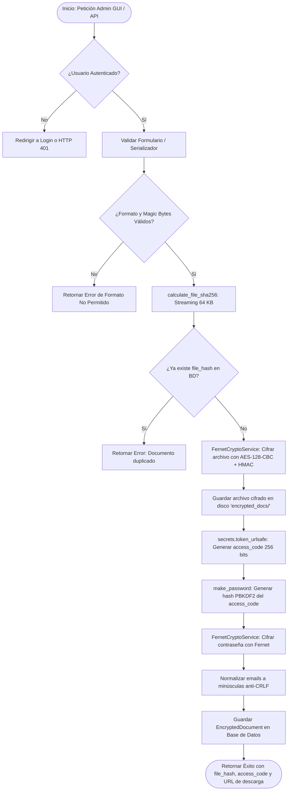
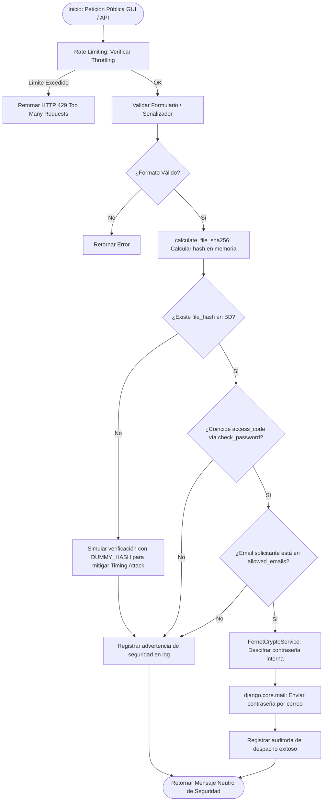
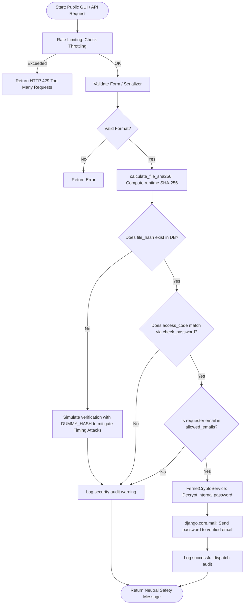

# Arquitectura del Sistema Freedec / Freedec System Architecture

<p align="center">
  <a href="#seccion-espanol"><b>🇪🇸 Leer en Español</b></a> &nbsp;&nbsp;|&nbsp;&nbsp; 
  <a href="#section-english"><b>🇬🇧 Read in English</b></a>
</p>

---

<a id="seccion-espanol"></a>
# 🇪🇸 Español

Este documento describe la arquitectura interna, el flujo de datos criptográficos y los diagramas de secuencia y flujo para la aplicación **Freedec**.

---

## 1. Visión General de la Arquitectura

Freedec implementa un patrón de **arquitectura orientada a servicios desacoplados** dentro del ecosistema Django / Django REST Framework (DRF):

```
┌────────────────────────────────────────────────────────────────────────┐
│                        Capa de Entrada (DRF Views / Web GUI)           │
│   - AdminDocumentUploadView / AdminUploadGuiView (Auth Requerida)      │
│   - PublicPasswordRequestView / PublicRequestGuiView (Acceso Público)  │
└───────────────────────────────────┬────────────────────────────────────┘
                                    │
                                    ▼
┌────────────────────────────────────────────────────────────────────────┐
│                     Capa de Validación (Forms & Serializers)           │
│   - AdminDocumentUploadSerializer / AdminDocumentUploadForm            │
│   - PublicPasswordRequestSerializer / PublicPasswordRequestForm        │
└───────────────────────────────────┬────────────────────────────────────┘
                                    │
                                    ▼
┌────────────────────────────────────────────────────────────────────────┐
│                     Capa de Negocio (Services)                         │
│   - DocumentManagementService: Orquesta flujos de negocio              │
│   - FernetCryptoService: Motor simétrico autenticado (AES-128-CBC+HMAC)│
│   - calculate_file_sha256(): Motor streaming de hash en chunks (64KB)  │
│   - validators.py: Inspección de Magic Bytes y Anti-Zip Bomb           │
└───────────────────────┬───────────────────────────────┬────────────────┘
                        │                               │
                        ▼                               ▼
┌────────────────────────────────┐            ┌──────────────────────────┐
│      Capa de Persistencia      │            │     Servicio Externo     │
│   - EncryptedDocument (BD)     │            │   - django.core.mail     │
│   - Disco (encrypted_docs/)    │            │     (Console / SMTP)     │
└────────────────────────────────┘            └──────────────────────────┘
```

---

## 2. Diagramas de Flujo

### 2.1. Subida y Cifrado (Administrador)



---

### 2.2. Verificación y Recuperación (Público)



---

## 3. Modelo de Datos (`EncryptedDocument`)

| Campo | Tipo | Restricciones | Propósito de Seguridad |
| :--- | :--- | :--- | :--- |
| `file_hash` | `CharField(64)` | `unique=True`, `db_index=True` | Identificador criptográfico SHA-256 del archivo original. |
| `encrypted_file` | `FileField` | `upload_to='encrypted_docs/'` | Contenido binario cifrado en reposo con AES/Fernet. |
| `access_code` | `CharField(128)` | Hash PBKDF2 | Almacenamiento Zero-Knowledge del código secreto. |
| `encrypted_password`| `TextField` | Token base64 Fernet | Clave o contraseña cifrada con la clave maestra `FREEDEC_FERNET_KEY`. |
| `allowed_emails` | `JSONField` | `default=list` | Lista blanca de correos normalizados en minúsculas. |
| `created_at` | `DateTimeField`| `auto_now_add=True` | Trazabilidad y auditoría temporal. |
| `updated_at` | `DateTimeField`| `auto_now=True` | Trazabilidad de modificaciones. |

---
---

<a id="section-english"></a>
# 🇬🇧 English

This document outlines the internal architecture, cryptographic data flow, and flowcharts for the **Freedec** application.

---

## 1. Architectural Overview

Freedec implements a **decoupled service-oriented pattern** inside the Django / Django REST Framework (DRF) ecosystem:

```
┌────────────────────────────────────────────────────────────────────────┐
│                        Ingress Layer (DRF Views / Web GUI)             │
│   - AdminDocumentUploadView / AdminUploadGuiView (Auth Required)       │
│   - PublicPasswordRequestView / PublicRequestGuiView (Public Access)   │
└───────────────────────────────────┬────────────────────────────────────┘
                                    │
                                    ▼
┌────────────────────────────────────────────────────────────────────────┐
│                     Validation Layer (Forms & Serializers)             │
│   - AdminDocumentUploadSerializer / AdminDocumentUploadForm            │
│   - PublicPasswordRequestSerializer / PublicPasswordRequestForm        │
└───────────────────────────────────┬────────────────────────────────────┘
                                    │
                                    ▼
┌────────────────────────────────────────────────────────────────────────┐
│                       Service Layer (Services)                         │
│   - DocumentManagementService: Business workflow orchestrator          │
│   - FernetCryptoService: Authenticated symmetric cipher (AES-128-CBC)  │
│   - calculate_file_sha256(): Memory-safe chunked hashing (64 KB)       │
│   - validators.py: Deep Magic Byte inspection & Anti-Zip Bomb          │
└───────────────────────┬───────────────────────────────┬────────────────┘
                        │                               │
                        ▼                               ▼
┌────────────────────────────────┐            ┌──────────────────────────┐
│       Persistence Layer        │            │     External Service     │
│   - EncryptedDocument (DB)     │            │   - django.core.mail     │
│   - Disk (encrypted_docs/)     │            │     (Console / SMTP)     │
└────────────────────────────────┘            └──────────────────────────┘
```

---

## 2. Flowcharts

### 2.1. Admin Upload and Encryption Flow


---

### 2.2. Public Verification and Password Retrieval Flow



---

## 3. Data Model (`EncryptedDocument`)

| Field | Type | Constraints | Security Purpose |
| :--- | :--- | :--- | :--- |
| `file_hash` | `CharField(64)` | `unique=True`, `db_index=True` | Cryptographic SHA-256 identifier of original unencrypted file. |
| `encrypted_file` | `FileField` | `upload_to='encrypted_docs/'` | Binary content encrypted at rest with AES/Fernet. |
| `access_code` | `CharField(128)` | PBKDF2 Hash | Zero-Knowledge storage of secret access code. |
| `encrypted_password`| `TextField` | Fernet base64 token | Decryption key encrypted with `FREEDEC_FERNET_KEY`. |
| `allowed_emails` | `JSONField` | `default=list` | Whitelist of normalized lowercase email addresses. |
| `created_at` | `DateTimeField`| `auto_now_add=True` | Audit trail and temporal traceability. |
| `updated_at` | `DateTimeField`| `auto_now=True` | Traceability of modifications. |
