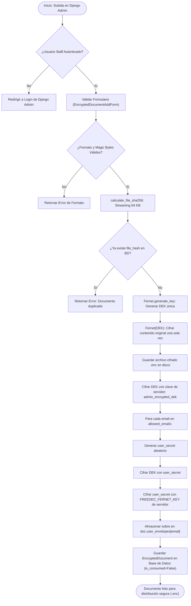
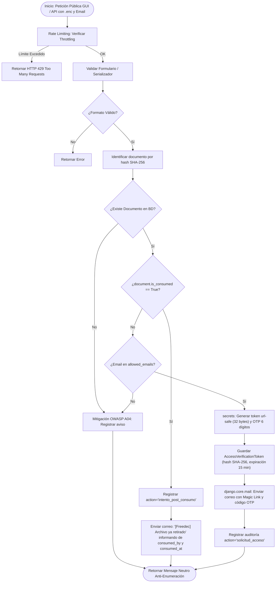
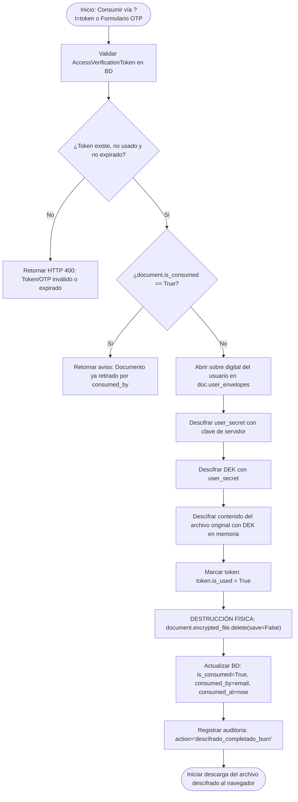
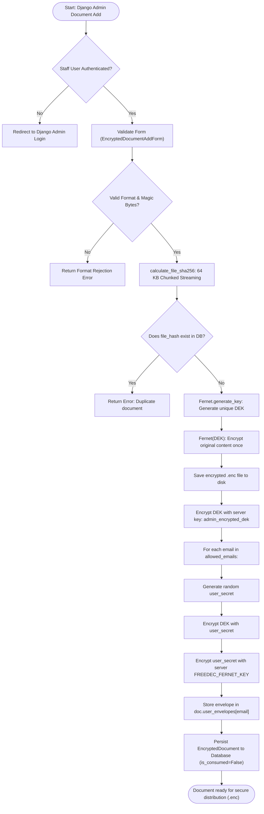
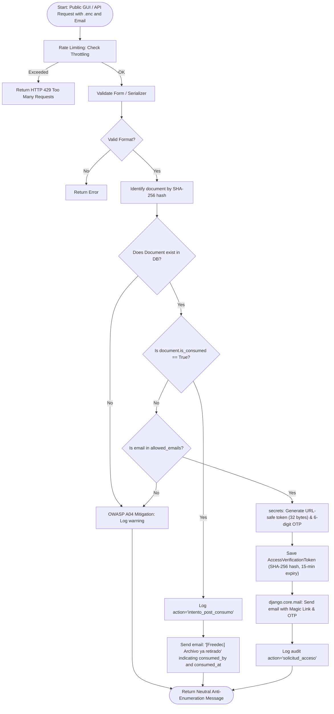
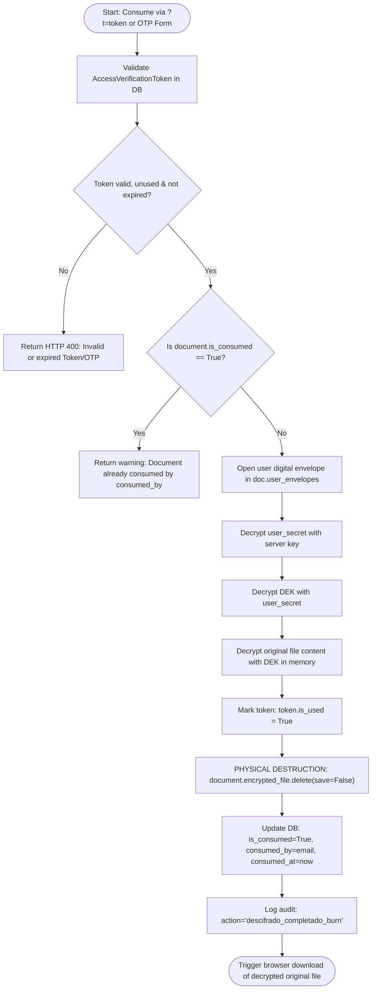

# Arquitectura del Sistema Freedec / Freedec System Architecture

<p align="center">
  <a href="#seccion-espanol"><b>🇪🇸 Leer en Español</b></a> &nbsp;&nbsp;|&nbsp;&nbsp; 
  <a href="#section-english"><b>🇬🇧 Read in English</b></a>
</p>

---

<a id="seccion-espanol"></a>
# 🇪🇸 Español

Este documento describe la arquitectura interna, el flujo de datos criptográficos DEK multi-usuario, el esquema dinámico de prueba de posesión por Enlace Mágico / OTP (15 min), la política destructiva **Burn-After-Read** y el acceso administrativo no destructivo (**Audit Bypass**) de **Freedec**.

---

## 1. Visión General de la Arquitectura

Freedec implementa un patrón de **arquitectura orientada a servicios desacoplados** dentro del ecosistema Django / Django REST Framework (DRF):

```
┌────────────────────────────────────────────────────────────────────────┐
│               Capa de Entrada (Django Admin / DRF / Web GUI)           │
│   - Django Admin (EncryptedDocumentAdmin - Auth Requerida / Gestión)   │
│   - PublicAccessRequestView / PublicRequestGuiView (Solicitud Acceso)  │
│   - PublicConsumeView / PublicConsumeGuiView (Consumo Burn-After-Read) │
└───────────────────────────────────┬────────────────────────────────────┘
                                    │
                                    ▼
┌────────────────────────────────────────────────────────────────────────┐
│                     Capa de Validación (Forms & Serializers)           │
│   - EncryptedDocumentAddForm / EncryptedDocumentChangeForm (Admin)     │
│   - PublicAccessRequestSerializer / PublicAccessRequestForm            │
│   - PublicConsumeSerializer / PublicConsumeDocumentForm                │
└───────────────────────────────────┬────────────────────────────────────┘
                                    │
                                    ▼
┌────────────────────────────────────────────────────────────────────────┐
│                     Capa de Negocio (Services)                         │
│   - DocumentManagementService: Orquesta flujos DEK, Magic Link y Burn  │
│   - FernetCryptoService: Motor simétrico autenticado (AES-128-CBC+HMAC)│
│   - calculate_file_sha256(): Motor streaming de hash en chunks (64KB)  │
│   - validators.py: Inspección de Magic Bytes y Anti-Zip Bomb           │
└───────────────────────┬───────────────────────────────┬────────────────┘
                        │                               │
                        ▼                               ▼
┌────────────────────────────────┐            ┌──────────────────────────┐
│      Capa de Persistencia      │            │     Servicio Externo     │
│   - EncryptedDocument (BD)     │            │   - django.core.mail     │
│   - AccessVerificationToken(BD)│            │     (Console / SMTP)     │
│   - DocumentAccessLog (BD)     │            │   - Enlace Mágico & OTP  │
│   - Disco (.enc en MEDIA_ROOT) │            └──────────────────────────┘
└────────────────────────────────┘
```

---

## 2. Diagramas de Flujo Criptográficos

### 2.1. Subida y Cifrado DEK Multi-Usuario (Administrador)



---

### 2.2. Solicitud de Acceso (Enlace Mágico & OTP - 15 Minutos)



---

### 2.3. Consumo, Descarga y Destrucción Física (Burn-After-Read)



---

## 3. Modelo de Datos

### 3.1. `EncryptedDocument`
| Campo | Tipo | Restricciones | Propósito de Seguridad |
| :--- | :--- | :--- | :--- |
| `original_filename` | `CharField(255)` | `default='documento'` | Preservación del nombre original para entrega al descifrar. |
| `file_hash` | `CharField(64)` | `unique=True`, `db_index=True` | Huella digital SHA-256 del contenido original (anti-IDOR). |
| `encrypted_file` | `FileField` | `upload_to='encrypted_docs/'` | Archivo binario `.enc` cifrado en reposo con la DEK. |
| `encrypted_file_hash`| `CharField(64)` | `blank=True`, `db_index=True` | Hash SHA-256 del archivo cifrado `.enc` en reposo. |
| `admin_encrypted_dek` | `TextField` | `blank=True` | DEK cifrada con la clave del servidor para descarga administrativa protegida. |
| `user_envelopes` | `JSONField` | `default=dict` | Sobres digitales indexados por email (`encrypted_dek`, `encrypted_user_secret`). |
| `allowed_emails` | `JSONField` | `default=list` | Lista blanca de correos autorizados a solicitar acceso. |
| `is_consumed` | `BooleanField` | `default=False`, `db_index=True` | Estado del ciclo de vida (Burn-After-Read). |
| `consumed_by` | `EmailField` | `null=True`, `blank=True` | Correo del usuario que realizó la descarga destructiva. |
| `consumed_at` | `DateTimeField` | `null=True`, `blank=True` | Fecha y hora exacta de la destrucción del binario. |
| `access_count` | `PositiveIntegerField` | `default=0` | Contador de accesos y recuperaciones. |
| `last_accessed_at` | `DateTimeField` | `null=True`, `blank=True` | Fecha y hora del último acceso. |
| `last_accessed_by` | `CharField(254)` | `blank=True` | Identificador del último usuario solicitante. |
| `created_at` | `DateTimeField` | `auto_now_add=True` | Auditoría temporal de registro. |
| `updated_at` | `DateTimeField` | `auto_now=True` | Trazabilidad de modificaciones. |

### 3.2. `AccessVerificationToken`
| Campo | Tipo | Restricciones | Propósito de Seguridad |
| :--- | :--- | :--- | :--- |
| `document` | `ForeignKey(EncryptedDocument)` | `on_delete=CASCADE` | Vinculación estricta al documento solicitado. |
| `email` | `EmailField` | `db_index=True` | Correo verificado del solicitante. |
| `token_hash` | `CharField(128)` | SHA-256 | Hash del token plano (el token plano nunca se guarda en BD). |
| `otp_code` | `CharField(6)` | 6 dígitos numéricos | Código alternativo para introducción manual. |
| `created_at` | `DateTimeField` | `auto_now_add=True` | Fecha de emisión. |
| `expires_at` | `DateTimeField` | 15 minutos | Caducidad estricta para mitigar ataques de replay. |
| `is_used` | `BooleanField` | `default=False` | Bandera de uso único. |

### 3.3. `DocumentAccessLog` (Tabla de Auditoría)
| Campo | Tipo | Relación / Atributos | Propósito de Auditoría |
| :--- | :--- | :--- | :--- |
| `document` | `ForeignKey(EncryptedDocument)` | `on_delete=CASCADE` | Documento consultado. |
| `timestamp` | `DateTimeField` | `auto_now_add=True`, `db_index=True` | Marca de tiempo inmutable. |
| `email` | `EmailField` | Normalizado en minúsculas | Dirección del solicitante. |
| `action` | `CharField(64)` | Acciones auditadas | `solicitud_acceso`, `descifrado_completado_burn`, `intento_post_consumo`, `admin_inspeccion_preservada`, etc. |
| `ip_address` | `GenericIPAddressField` | `null=True`, `blank=True` | Dirección IP remota (IPv4/IPv6 y proxies). |
| `user_agent` | `TextField` | `null=True`, `blank=True` | Huella del navegador / cliente HTTP. |

---

## 4. Acceso Administrativo Preservado (Audit Bypass)

Para garantizar la supervisión y recuperación ante incidentes por personal administrativo autorizado:
1. **Descarga Administrativa**: El staff autenticado en Django Admin dispone del botón **"🔓 Original (Admin)"**.
2. **Descifrado con Clave Maestra de Servidor**: El backend utiliza `admin_encrypted_dek` y `FREEDEC_FERNET_KEY` para descifrar el binario sin requerir secretos de usuario ni enviar correos.
3. **No Destructivo**: La descarga administrativa **NO elimina el archivo en disco** ni marca el documento como consumido.
4. **Trazabilidad Obligatoria**: Se genera una entrada en `DocumentAccessLog` con `action="admin_inspeccion_preservada"`.

---

## 5. Ciclo de Vida y Destrucción Física

1. **Burn-After-Read (Consumo por Usuario Final)**: Al completarse la descarga del documento original por parte de un usuario autorizado, se invoca `document.encrypted_file.delete(save=False)`.
2. **Derecho al Olvido (RGPD / GDPR)**: Si un documento no consumido es eliminado por el administrador o mediante `python manage.py delete_document`, la señal `post_delete` elimina físicamente el fichero `.enc` de disco.

---
---

<a id="section-english"></a>
# 🇬🇧 English

This document details the internal architecture, multi-user DEK envelope cryptographic flow, dynamic proof-of-possession via Magic Link / OTP (15 min), **Burn-After-Read** destructive policy, and non-destructive administrative access (**Audit Bypass**) of **Freedec**.

---

## 1. Architectural Overview

Freedec implements a **decoupled service-oriented pattern** inside the Django / Django REST Framework (DRF) ecosystem:

```
┌────────────────────────────────────────────────────────────────────────┐
│               Ingress Layer (Django Admin / DRF / Web GUI)             │
│   - Django Admin (EncryptedDocumentAdmin - Auth Required / Management) │
│   - PublicAccessRequestView / PublicRequestGuiView (Access Request)    │
│   - PublicConsumeView / PublicConsumeGuiView (Burn-After-Read Consume) │
└───────────────────────────────────┬────────────────────────────────────┘
                                    │
                                    ▼
┌────────────────────────────────────────────────────────────────────────┐
│                     Validation Layer (Forms & Serializers)             │
│   - EncryptedDocumentAddForm / EncryptedDocumentChangeForm (Admin)     │
│   - PublicAccessRequestSerializer / PublicAccessRequestForm            │
│   - PublicConsumeSerializer / PublicConsumeDocumentForm                │
└───────────────────────────────────┬────────────────────────────────────┘
                                    │
                                    ▼
┌────────────────────────────────────────────────────────────────────────┐
│                       Service Layer (Services)                         │
│   - DocumentManagementService: Orchestrates DEK, Magic Link & Burn     │
│   - FernetCryptoService: Authenticated symmetric cipher (AES-128-CBC)  │
│   - calculate_file_sha256(): Memory-safe chunked hashing (64 KB)       │
│   - validators.py: Deep Magic Byte inspection & Anti-Zip Bomb          │
└───────────────────────┬───────────────────────────────┬────────────────┘
                        │                               │
                        ▼                               ▼
┌────────────────────────────────┐            ┌──────────────────────────┐
│       Persistence Layer        │            │     External Service     │
│   - EncryptedDocument (DB)     │            │   - django.core.mail     │
│   - AccessVerificationToken(DB)│            │     (Console / SMTP)     │
│   - DocumentAccessLog (DB)     │            │   - Magic Link & OTP     │
│   - Disk (.enc in MEDIA_ROOT)  │            └──────────────────────────┘
└────────────────────────────────┘
```

---

## 2. Cryptographic Flowcharts

### 2.1. Admin Upload and Multi-User DEK Encryption



---

### 2.2. Access Request Flow (Magic Link & 15-Minute OTP)



---

### 2.3. Consumption, Decryption and Physical Destruction (Burn-After-Read)



---

## 3. Data Model

### 3.1. `EncryptedDocument`
| Field | Type | Constraints | Security Purpose |
| :--- | :--- | :--- | :--- |
| `original_filename` | `CharField(255)` | `default='documento'` | Original file name preservation for download. |
| `file_hash` | `CharField(64)` | `unique=True`, `db_index=True` | Cryptographic SHA-256 identifier of unencrypted content. |
| `encrypted_file` | `FileField` | `upload_to='encrypted_docs/'` | Binary `.enc` file encrypted at rest with DEK. |
| `encrypted_file_hash`| `CharField(64)` | `blank=True`, `db_index=True` | SHA-256 hash of the `.enc` file at rest. |
| `admin_encrypted_dek` | `TextField` | `blank=True` | DEK encrypted with server key for preserved administrative download. |
| `user_envelopes` | `JSONField` | `default=dict` | Digital envelopes indexed by email (`encrypted_dek`, `encrypted_user_secret`). |
| `allowed_emails` | `JSONField` | `default=list` | Whitelist of authorized recipient emails. |
| `is_consumed` | `BooleanField` | `default=False`, `db_index=True` | Lifecycle state (Burn-After-Read). |
| `consumed_by` | `EmailField` | `null=True`, `blank=True` | Email of user who performed destructive consumption. |
| `consumed_at` | `DateTimeField` | `null=True`, `blank=True` | Exact timestamp of file deletion. |
| `access_count` | `PositiveIntegerField` | `default=0` | Total access / consumption counter. |
| `last_accessed_at` | `DateTimeField` | `null=True`, `blank=True` | Timestamp of last access. |
| `last_accessed_by` | `CharField(254)` | `blank=True` | Email of last requester. |
| `created_at` | `DateTimeField` | `auto_now_add=True` | Temporal audit trail. |
| `updated_at` | `DateTimeField` | `auto_now=True` | Modification traceability. |

### 3.2. `AccessVerificationToken`
| Field | Type | Constraints | Security Purpose |
| :--- | :--- | :--- | :--- |
| `document` | `ForeignKey(EncryptedDocument)` | `on_delete=CASCADE` | Foreign key relation to target document. |
| `email` | `EmailField` | `db_index=True` | Authorized recipient email. |
| `token_hash` | `CharField(128)` | SHA-256 | SHA-256 hash of plaintext token (raw token never stored). |
| `otp_code` | `CharField(6)` | 6 numeric digits | Alternative one-time code for manual entry. |
| `created_at` | `DateTimeField` | `auto_now_add=True` | Creation timestamp. |
| `expires_at` | `DateTimeField` | 15 minutes | Strict expiration to prevent replay attacks. |
| `is_used` | `BooleanField` | `default=False` | One-time usage flag. |

### 3.3. `DocumentAccessLog`
| Field | Type | Relation / Attributes | Audit Purpose |
| :--- | :--- | :--- | :--- |
| `document` | `ForeignKey(EncryptedDocument)` | `on_delete=CASCADE` | Target document. |
| `timestamp` | `DateTimeField` | `auto_now_add=True`, `db_index=True` | Immutable event timestamp. |
| `email` | `EmailField` | Normalized lowercase | Requester email address. |
| `action` | `CharField(64)` | Event actions | `solicitud_acceso`, `descifrado_completado_burn`, `intento_post_consumo`, `admin_inspeccion_preservada`, etc. |
| `ip_address` | `GenericIPAddressField` | `null=True`, `blank=True` | Remote IP address (IPv4/IPv6 and reverse proxies). |
| `user_agent` | `TextField` | `null=True`, `blank=True` | Browser / HTTP client fingerprint. |

---

## 4. Preserved Administrative Access (Audit Bypass)

1. **Staff Admin Download**: Authenticated staff in Django Admin can click **"🔓 Original (Admin)"**.
2. **Server Key Decryption**: The backend uses `admin_encrypted_dek` and `FREEDEC_FERNET_KEY` to decrypt the original binary without needing user secrets.
3. **Non-Destructive**: Administrative downloads **do not delete the file** and do not set `is_consumed = True`.
4. **Mandatory Audit Logging**: An event with `action="admin_inspeccion_preservada"` is recorded in `DocumentAccessLog`.
