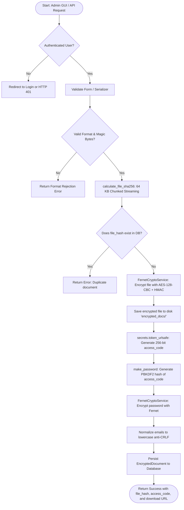

# Arquitectura del Sistema Freedec / Freedec System Architecture

<p align="center">
  <a href="#seccion-espanol"><b>🇪🇸 Leer en Español</b></a> &nbsp;&nbsp;|&nbsp;&nbsp; 
  <a href="#section-english"><b>🇬🇧 Read in English</b></a>
</p>

---

<a id="seccion-espanol"></a>
# 🇪🇸 Español

Este documento describe la arquitectura interna, el flujo de datos criptográficos y los diagramas de secuencia y flujo para la aplicación **Freedec**.

---

## 1. Visión General de la Arquitectura

Freedec implementa un patrón de **arquitectura orientada a servicios desacoplados** dentro del ecosistema Django / Django REST Framework (DRF):

```
┌────────────────────────────────────────────────────────────────────────┐
│                        Capa de Entrada (DRF Views / Web GUI)           │
│   - AdminDocumentUploadView / AdminUploadGuiView (Auth Requerida)      │
│   - PublicPasswordRequestView / PublicRequestGuiView (Acceso Público)  │
└───────────────────────────────────┬────────────────────────────────────┘
                                    │
                                    ▼
┌────────────────────────────────────────────────────────────────────────┐
│                     Capa de Validación (Forms & Serializers)           │
│   - AdminDocumentUploadSerializer / AdminDocumentUploadForm            │
│   - PublicPasswordRequestSerializer / PublicPasswordRequestForm        │
└───────────────────────────────────┬────────────────────────────────────┘
                                    │
                                    ▼
┌────────────────────────────────────────────────────────────────────────┐
│                     Capa de Negocio (Services)                         │
│   - DocumentManagementService: Orquesta flujos de negocio              │
│   - FernetCryptoService: Motor simétrico autenticado (AES-128-CBC+HMAC)│
│   - calculate_file_sha256(): Motor streaming de hash en chunks (64KB)  │
│   - validators.py: Inspección de Magic Bytes y Anti-Zip Bomb           │
└───────────────────────┬───────────────────────────────┬────────────────┘
                        │                               │
                        ▼                               ▼
┌────────────────────────────────┐            ┌──────────────────────────┐
│      Capa de Persistencia      │            │     Servicio Externo     │
│   - EncryptedDocument (BD)     │            │   - django.core.mail     │
│   - Disco (encrypted_docs/)    │            │     (Console / SMTP)     │
└────────────────────────────────┘            └──────────────────────────┘
```

---

## 2. Diagramas de Flujo

### 2.1. Subida y Cifrado (Administrador)


---

### 2.2. Verificación y Recuperación (Público)


---

## 3. Modelo de Datos

### 3.1. `EncryptedDocument`
| Campo | Tipo | Restricciones | Propósito de Seguridad |
| :--- | :--- | :--- | :--- |
| `original_filename` | `CharField(255)` | `default='documento'` | Preservación segura del nombre original para el archivo cifrado (.enc) y recuperación. |
| `file_hash` | `CharField(64)` | `unique=True`, `db_index=True` | Identificador criptográfico SHA-256 del archivo original. |
| `encrypted_file` | `FileField` | `upload_to='encrypted_docs/'` | Contenido binario cifrado en reposo con AES/Fernet (nombrado `<original_filename>.enc`). |
| `access_code` | `CharField(128)` | Hash PBKDF2 | Almacenamiento Zero-Knowledge del código secreto. |
| `encrypted_password`| `TextField` | Token base64 Fernet | Clave o contraseña cifrada con la clave maestra `FREEDEC_FERNET_KEY`. |
| `allowed_emails` | `JSONField` | `default=list` | Lista blanca de correos normalizados en minúsculas. |
| `access_count` | `PositiveIntegerField` | `default=0` | Contador de accesos y recuperaciones autorizadas. |
| `last_accessed_at` | `DateTimeField` | `null=True`, `blank=True` | Fecha y hora del último acceso o descarga. |
| `last_accessed_by` | `CharField(254)` | `blank=True` | Correo electrónico del último solicitante autorizado. |
| `created_at` | `DateTimeField` | `auto_now_add=True` | Trazabilidad y auditoría temporal de registro. |
| `updated_at` | `DateTimeField` | `auto_now=True` | Trazabilidad de modificaciones de registro. |

### 3.2. `DocumentAccessLog` (Tabla de Auditoría)
| Campo | Tipo | Relación / Atributos | Propósito de Auditoría |
| :--- | :--- | :--- | :--- |
| `document` | `ForeignKey(EncryptedDocument)` | `on_delete=CASCADE` | Vinculación estricta al documento consultado. |
| `timestamp` | `DateTimeField` | `auto_now_add=True`, `db_index=True` | Marca de tiempo exacta del intento o acceso. |
| `email` | `EmailField` | Normalizado en minúsculas | Dirección del solicitante. |
| `action` | `CharField(64)` | `solicitud_clave`, `descifrado`, etc. | Tipo de evento o acción ejecutada. |
| `ip_address` | `GenericIPAddressField` | `null=True`, `blank=True` | Dirección IP remota (compatible IPv4/IPv6 y proxies inversos). |

---

## 4. Ciclo de Vida y Eliminación Física Segura

Para cumplir con el **Derecho al Olvido (RGPD / GDPR)** y prevenir archivos huérfanos confidenciales en disco:
1. **Señal `post_delete`**: Conectada a `EncryptedDocument` en [`models.py`](file:///home/jorge/GitHubRepositories/Freedec/freedec/models.py). Cuando un registro se elimina desde el Admin de Django, la API o el ORM, se elimina automáticamente el archivo físico (`.enc`) de `MEDIA_ROOT`.
2. **Comando de Gestión CLI**: `python manage.py delete_document` permite listar o eliminar documentos específicos (o todos con `--all`) eliminando tanto el registro en BD como el archivo físico.
3. **Botón en Django Admin**: La vista de lista en el panel administrativo incluye un botón directo `🗑️ Eliminar` por cada fila.

---

## 5. Recibos de Credenciales y Portal de Descifrado

1. **Recibo Descargable `.txt`**:
   - Al registrar un documento en Django Admin, el navegador descarga automáticamente un archivo de texto plano (`<original_filename>_credenciales.txt`) que contiene el hash, el código de acceso, la contraseña asignada, los correos autorizados y los enlaces directos.
   - Se genera en memoria mediante un `data:text/plain;charset=utf-8` Data URI sin almacenar ficheros en texto claro en el servidor.
2. **Portal de Descifrado `/freedec/descifrar/`**:
   - Permite al usuario final subir su archivo `.enc` y su contraseña recibida por correo para descargar en el acto el documento original descifrado.

---

## 6. Despliegue en Apache y Compatibilidad Multi-App

1. **Aislamiento bajo prefijo `freedec/`**: Todas las URLs de la aplicación cuelgan de `path('freedec/', include('freedec.urls', namespace='freedec'))` para evitar colisiones con otras aplicaciones en el mismo dominio o VirtualHost de Apache.
2. **Resolución dinámica con `` y `SCRIPT_NAME`**: Las plantillas HTML no tienen rutas absolutas fijadas a la raíz `/`, permitiendo que Apache monte la app en subdirectorios mediante `WSGIScriptAlias` o `ProxyPass`.
3. **Panel de Administración Desacoplado**: Se utiliza `reverse('admin:index')` para resolver dinámicamente la URL del admin del proyecto anfitrión.


<a id="section-english"></a>
# 🇬🇧 English

This document outlines the internal architecture, cryptographic data flow, and flowcharts for the **Freedec** application.

---

## 1. Architectural Overview

Freedec implements a **decoupled service-oriented pattern** inside the Django / Django REST Framework (DRF) ecosystem:

```
┌────────────────────────────────────────────────────────────────────────┐
│                        Ingress Layer (DRF Views / Web GUI)             │
│   - AdminDocumentUploadView / AdminUploadGuiView (Auth Required)       │
│   - PublicPasswordRequestView / PublicRequestGuiView (Public Access)   │
└───────────────────────────────────┬────────────────────────────────────┘
                                    │
                                    ▼
┌────────────────────────────────────────────────────────────────────────┐
│                     Validation Layer (Forms & Serializers)             │
│   - AdminDocumentUploadSerializer / AdminDocumentUploadForm            │
│   - PublicPasswordRequestSerializer / PublicPasswordRequestForm        │
└───────────────────────────────────┬────────────────────────────────────┘
                                    │
                                    ▼
┌────────────────────────────────────────────────────────────────────────┐
│                       Service Layer (Services)                         │
│   - DocumentManagementService: Business workflow orchestrator          │
│   - FernetCryptoService: Authenticated symmetric cipher (AES-128-CBC)  │
│   - calculate_file_sha256(): Memory-safe chunked hashing (64 KB)       │
│   - validators.py: Deep Magic Byte inspection & Anti-Zip Bomb          │
└───────────────────────┬───────────────────────────────┬────────────────┘
                        │                               │
                        ▼                               ▼
┌────────────────────────────────┐            ┌──────────────────────────┐
│       Persistence Layer        │            │     External Service     │
│   - EncryptedDocument (DB)     │            │   - django.core.mail     │
│   - Disk (encrypted_docs/)     │            │     (Console / SMTP)     │
└────────────────────────────────┘            └──────────────────────────┘
```

---

## 2. Flowcharts

### 2.1. Admin Upload and Encryption Flow



---

### 2.2. Public Verification and Password Retrieval Flow


---

## 3. Data Model

### 3.1. `EncryptedDocument`
| Field | Type | Constraints | Security Purpose |
| :--- | :--- | :--- | :--- |
| `original_filename` | `CharField(255)` | `default='documento'` | Safe preservation of the original file name for `.enc` distribution and recovery. |
| `file_hash` | `CharField(64)` | `unique=True`, `db_index=True` | Cryptographic SHA-256 identifier of original unencrypted file. |
| `encrypted_file` | `FileField` | `upload_to='encrypted_docs/'` | Binary content encrypted at rest with AES/Fernet (packaged as `<original_filename>.enc`). |
| `access_code` | `CharField(128)` | PBKDF2 Hash | Zero-Knowledge storage of secret access code. |
| `encrypted_password`| `TextField` | Fernet base64 token | Decryption key encrypted with `FREEDEC_FERNET_KEY`. |
| `allowed_emails` | `JSONField` | `default=list` | Whitelist of normalized lowercase email addresses. |
| `access_count` | `PositiveIntegerField` | `default=0` | Counter of authorized retrievals and decryptions. |
| `last_accessed_at` | `DateTimeField` | `null=True`, `blank=True` | Timestamp of last access or download. |
| `last_accessed_by` | `CharField(254)` | `blank=True` | Email of last authorized requester. |
| `created_at` | `DateTimeField` | `auto_now_add=True` | Audit trail and temporal traceability. |
| `updated_at` | `DateTimeField` | `auto_now=True` | Traceability of record modifications. |

### 3.2. `DocumentAccessLog` (Audit Log Table)
| Field | Type | Relation / Attributes | Audit Purpose |
| :--- | :--- | :--- | :--- |
| `document` | `ForeignKey(EncryptedDocument)` | `on_delete=CASCADE` | Direct foreign key relation to queried document. |
| `timestamp` | `DateTimeField` | `auto_now_add=True`, `db_index=True` | Exact timestamp of retrieval attempt or access. |
| `email` | `EmailField` | Normalized lowercase | Requester email address. |
| `action` | `CharField(64)` | `solicitud_clave`, `descifrado`, etc. | Action type performed. |
| `ip_address` | `GenericIPAddressField` | `null=True`, `blank=True` | Remote IP address (IPv4/IPv6 and reverse-proxy compatible). |

---

## 4. Lifecycle & Secure Physical File Erasure

To adhere to the **Right to Erasure (GDPR)** and prevent orphaned confidential files on disk:
1. **`post_delete` Signal**: Attached to `EncryptedDocument` in [`models.py`](file:///home/jorge/GitHubRepositories/Freedec/freedec/models.py). When a record is deleted from Django Admin, the REST API, or ORM, the physical `.enc` file in `MEDIA_ROOT` is automatically deleted from disk.
2. **CLI Management Command**: `python manage.py delete_document` provides `--list`, `--all`, or target name/hash deletion for complete database and physical unlinking.
3. **Django Admin Button**: A direct `🗑️ Eliminar` button is provided in each table row in Django Admin.

---

## 5. Credential Receipts & Decryption Portal

1. **Downloadable `.txt` Credentials Receipt**:
   - On document registration in Django Admin, the browser automatically downloads `<original_filename>_credenciales.txt` containing the file hash, access code, password, authorized emails, and direct portal links.
   - Generated client-side using `data:text/plain;charset=utf-8` Data URIs without storing plaintext credentials on the server.
2. **Decryption Portal `/freedec/descifrar/`**:
   - Allows users to upload their `.enc` file and enter their emailed password to instantly download the decrypted original document.

---

## 6. Apache Deployment & Multi-App Compatibility

1. **Isolation under `freedec/` prefix**: All application endpoints are mounted under `path('freedec/', include('freedec.urls', namespace='freedec'))` avoiding route clashes with other applications on the same Apache domain or VirtualHost.
2. **Dynamic resolution with `` and `SCRIPT_NAME`**: Templates avoid hardcoded root paths, allowing Apache to host the app in any subfolder via `WSGIScriptAlias` or `ProxyPass`.
3. **Decoupled Admin Integration**: Uses `reverse('admin:index')` to dynamically link to the host project's Django admin site.

