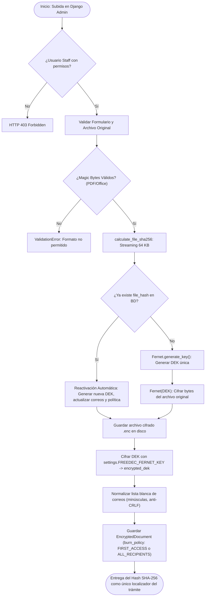
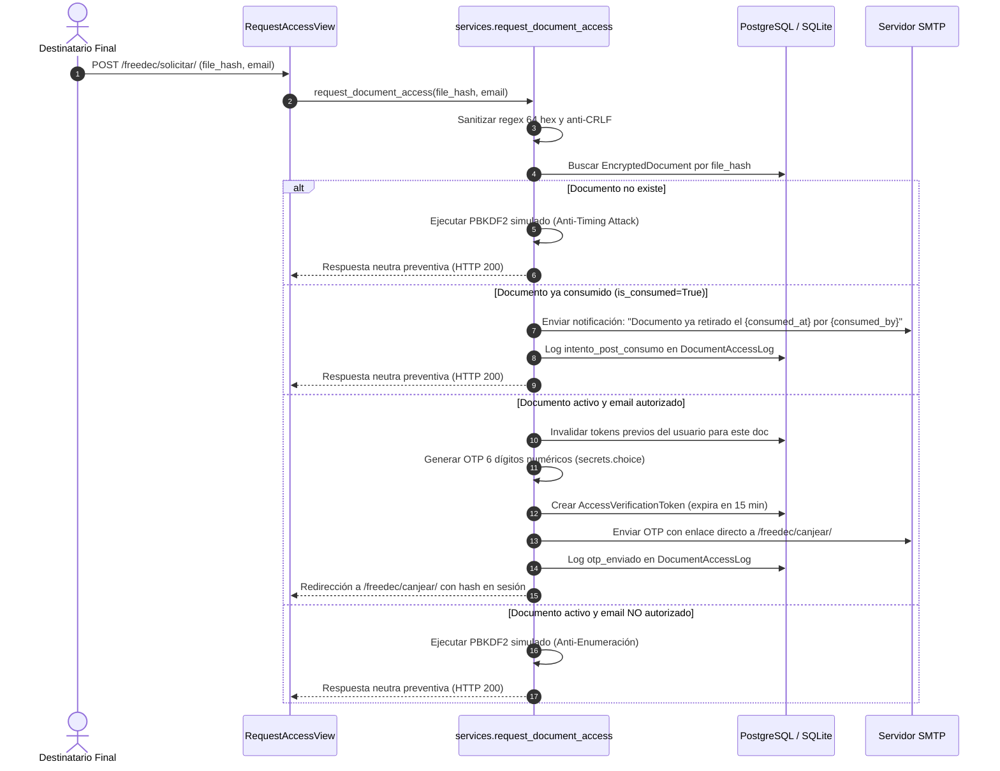
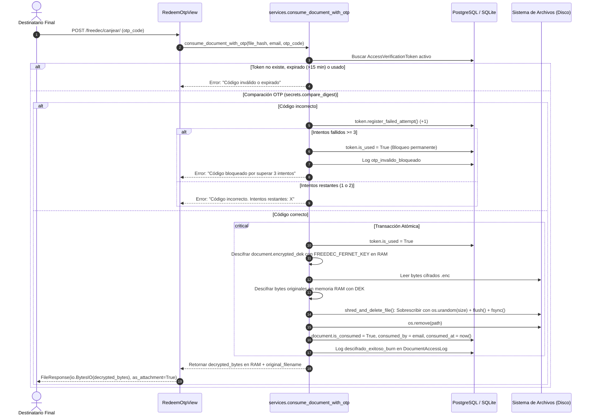

# Arquitectura del Sistema Freedec / Freedec System Architecture

<p align="center">
  <a href="#seccion-espanol"><b>🇪🇸 Leer en Español</b></a> &nbsp;&nbsp;|&nbsp;&nbsp; 
  <a href="#section-english"><b>🇬🇧 Read in English</b></a>
</p>

---

<a id="seccion-espanol"></a>
# 🇪🇸 Español

Este documento describe la arquitectura interna, los principios de diseño de ciberseguridad, el flujo criptográfico de **Clave Maestra de Datos (DEK)**, la verificación en tiempo real por **OTP (One-Time Password)** de 15 minutos, la destrucción física segura (**Burn-After-Read / Zeroization**) y la auditoría legal de **Freedec**.

---

## 1. Principios de Diseño y Reglas de Oro

1. **CERO TRANSPORTE DEL BINARIO POR EL CLIENTE**:
   El usuario final **NUNCA** sube el archivo `.enc` para identificarse o solicitar acceso. El identificador oficial, localizador y prueba de trámite es exclusivamente el **hash SHA-256** del archivo original (cadena hexadecimal de 64 caracteres).
2. **SIN CONTRASEÑAS HUMANAS (Zero Human-Readable Passwords)**:
   Ningún usuario ni administrador visualiza, ingresa o gestiona contraseñas en texto claro. El descifrado es 100% interno y desatendido por el propio backend en memoria RAM tras validar el OTP.
3. **BURN-AFTER-READ CON DESTRUCCIÓN SEGURA (Zeroization/Shredding)**:
   Al primer canje exitoso por un usuario autorizado, el archivo cifrado en disco se sobrescribe con bytes criptográficamente aleatorios (`os.urandom(file_size)`), forzando la sincronización en disco físico (`flush()` y `os.fsync()`) antes de desvincularlo (`os.remove()`), y el registro pasa a estado consumido.

---

## 2. Visión General de la Arquitectura de Capas

Freedec implementa una arquitectura orientada a servicios desacoplados en Django:

```
┌────────────────────────────────────────────────────────────────────────┐
│               Capa de Entrada (Django Admin / Web GUI / REST API)      │
│   - Django Admin (EncryptedDocumentAdmin - Cero contraseñas visibles)  │
│   - RequestAccessView /api/public/request-access/ (SHA-256 + Email)    │
│   - RedeemOtpView /api/public/consume/ (Canje OTP + FileResponse RAM)  │
└───────────────────────────────────┬────────────────────────────────────┘
                                    │
                                    ▼
┌────────────────────────────────────────────────────────────────────────┐
│                     Capa de Validación (Forms & Serializers)           │
│   - EncryptedDocumentAddForm (Admin - Subida original + EmailList)     │
│   - RequestAccessForm / PublicAccessRequestSerializer (file_hash/email)│
│   - RedeemOtpForm / PublicConsumeSerializer (file_hash/email/otp_code) │
│   - validators.py (Magic Bytes PDF/Office, Anti-CRLF, Anti-Zip Bomb)   │
└───────────────────────────────────┬────────────────────────────────────┘
                                    │
                                    ▼
┌────────────────────────────────────────────────────────────────────────┐
│                     Capa de Negocio y Criptografía (Services)          │
│   - upload_and_encrypt_document(): DEK única + Cifrado KEK servidor    │
│   - request_document_access(): Anti-Timing PBKDF2 + Emisión OTP 15 min │
│   - consume_document_with_otp(): secrets.compare_digest + Shredding    │
│   - admin_decrypt_document(): Descarga de auditoría preservada (Staff) │
│   - shred_and_delete_file(): Zeroization física (os.urandom + fsync)   │
│   - calculate_file_sha256(): Streaming 64 KB anti-DoS / OOM           │
└───────────────────────┬───────────────────────────────┬────────────────┘
                        │                               │
                        ▼                               ▼
┌────────────────────────────────┐            ┌──────────────────────────┐
│      Capa de Persistencia      │            │     Servicio Externo     │
│   - EncryptedDocument (BD)     │            │   - django.core.mail     │
│   - AccessVerificationToken(BD)│            │     (Console / SMTP)     │
│   - DocumentAccessLog (BD)     │            │   - Código OTP / Avisos  │
│   - Almacenamiento (.enc disco)│            └──────────────────────────┘
└────────────────────────────────┘
```

---

## 3. Diagramas de Flujo y Secuencia

### 3.1. Alta Administrativa y Cifrado Desatendido con DEK



### 3.2. Solicitud de Canje Desatendido (SHA-256 + Email)



### 3.3. Canje, Descifrado en RAM y Destrucción Física (Burn-After-Read)



---

## 4. Modelos de Datos

### 4.1. `EncryptedDocument`
* `original_filename`: Nombre original del documento subido (`max_length=255`).
* `file_hash`: Hash SHA-256 del contenido original (`max_length=64, unique=True, db_index=True`).
* `encrypted_file`: Archivo cifrado en reposo (`upload_to="encrypted_docs/%Y/%m/"`).
* `encrypted_dek`: Clave Maestra de Datos (DEK) protegida y cifrada con `settings.FREEDEC_FERNET_KEY`.
* `allowed_emails`: Lista JSON de correos autorizados en minúsculas.
* `burn_policy`: Política de destrucción segura (`FIRST_ACCESS` = Destrucción al primer canje; `ALL_RECIPIENTS` = Destrucción solo cuando todos los destinatarios hayan canjeado).
* `consumed_recipients`: Lista JSON de destinatarios que ya han retirado su copia individual en política `ALL_RECIPIENTS`.
* `is_consumed`: Booleano (`default=False, db_index=True`).
* `consumed_by`: Email del destinatario que canjeó y provocó la destrucción (`EmailField`).
* `consumed_at`: Fecha y hora exacta del canje (`DateTimeField`).
* `created_at`: Marca temporal de alta (`DateTimeField(auto_now_add=True)`).
* `updated_at`: Marca temporal de última modificación o reactivación (`DateTimeField(auto_now=True)`).

### 4.2. `AccessVerificationToken`
* `document`: ForeignKey a `EncryptedDocument` (`related_name="verification_tokens"`).
* `email`: Correo oficial del solicitante (`EmailField(db_index=True)`).
* `otp_code`: Código numérico de 6 dígitos generado con `secrets.choice("0123456789")`.
* `created_at`: `DateTimeField(auto_now_add=True)`.
* `expires_at`: `DateTimeField` (caducidad estricta a 15 minutos).
* `is_used`: `BooleanField(default=False)`.
* `failed_attempts`: `PositiveSmallIntegerField(default=0)`. Se revoca automáticamente si alcanza 3.

### 4.3. `DocumentAccessLog`
* `document`: ForeignKey a `EncryptedDocument` (`related_name="access_logs"`).
* `email`: Correo del solicitante o identificador del auditor.
* `action`:
  * `solicitud_otp`: Solicitud registrada.
  * `otp_enviado`: Código OTP enviado por correo electrónico.
  * `descifrado_exitoso_burn`: Canje completado y archivo destruido físicamente en disco.
  * `descifrado_parcial_preservado`: Canje completado en política multi-destinatario manteniendo el archivo en disco.
  * `reactivacion_documento`: Reactivación administrativa del documento con nueva DEK y actualización de destinatarios.
  * `intento_post_consumo`: Solicitud recibida tras la destrucción del documento o intento de re-descarga.
  * `otp_invalido_bloqueado`: Token revocado al superar 3 intentos fallidos.
  * `admin_descarga_preservada`: Descarga de auditoría administrativa preservada.
* `ip_address`: Dirección IP cliente (considerando proxies inversos).
* `user_agent`: Cabecera de cliente para análisis forense.
* `created_at`: Fecha y hora exacta del evento.

---
---

<a id="section-english"></a>
# 🇬🇧 English

This document details the internal architecture, cybersecurity design principles, **Data Encryption Key (DEK)** cryptographic flow, real-time 15-minute **OTP (One-Time Password)** verification, secure physical destruction (**Burn-After-Read / Zeroization**), and legal audit logging of **Freedec**.

---

## 1. Design Principles & Golden Rules

1. **ZERO CLIENT BINARY TRANSPORT**:
   The end user **NEVER** uploads the `.enc` file to identify themselves or request access. The official locator and proof of transaction is exclusively the **SHA-256 hash** of the original file (64-character hexadecimal string).
2. **ZERO HUMAN-READABLE PASSWORDS**:
   Neither users nor administrators view, enter, or manage plaintext passwords. Decryption is 100% internal and unattended, performed strictly in RAM by backend code after validating the OTP.
3. **BURN-AFTER-READ WITH SECURE DESTRUCTION (Zeroization/Shredding)**:
   Upon the first successful redemption by an authorized user, the encrypted file on disk is overwritten with cryptographically random bytes (`os.urandom(file_size)`), flushed and synced to physical storage (`flush()` and `os.fsync()`) before unlinking (`os.remove()`), and the record transitions to consumed.

---

## 2. Layered Architecture Overview

Freedec implements a decoupled service-oriented architecture in Django:
* **Entry Layer**: Django Admin (zero passwords visible), `RequestAccessView` (`/freedec/solicitar/`), `RedeemOtpView` (`/freedec/canjear/`), and REST API endpoints.
* **Validation Layer**: Binary Magic Bytes inspection (`validators.py`), CRLF sanitization, and 64-character SHA-256 regex checking.
* **Service Layer**: Envelope Encryption (`upload_and_encrypt_document`), Anti-Timing PBKDF2 (`request_document_access`), constant-time OTP verification and Zeroization (`consume_document_with_otp`), and preserved administrative audit (`admin_decrypt_document`).
* **Persistence Layer**: `EncryptedDocument`, `AccessVerificationToken`, `DocumentAccessLog`, and encrypted storage on disk.
